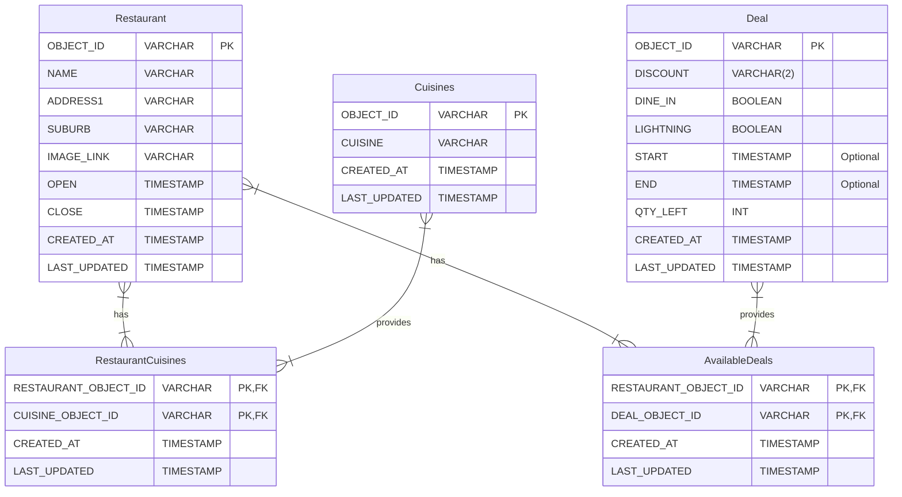

# eatclub-deals

Implementation of EatClub Developer Challenge

## Requirements

- Java 21
- Maven 3.9

## Build & Test

To build and run tests:

```shell
$ mvn clean package
```

## Running

To run the application locally, use Quarkus Dev mode. The application will be available at http://localhost:8080/

```shell
$ mvn quarkus:dev
```

### Deploying to AWS

The application can be deployed to AWS by using the `cdk` module. It will deploy using the AWS profile set on the CLI
via the [AWS env vars][1]

[1]: https://docs.aws.amazon.com/cli/latest/userguide/cli-configure-envvars.html

```shell
$ cd cdk && cdk deploy
```

The application must be built before deploying as the CDK module will use the ZIP file produced by the Maven build.

To assist, a `deploy.sh` script is provided.

## Database Schema



### Description

- Restaurant: Details about restaurants.
- Cuisines: Standardised list of cuisines that a restaurant serves.
- RestaurantCuisines: Multiple cuisines can be served by multiple restaurants.
- Deal: A deal that can be applied to a restaurant.
- AvailableDeals: A restaurant can have multiple deals, and multiple deals can be applied at a restaurant.

The database schema is defined for the MySQL database. It's the one that I have the most experience with, and have used
for previous projects. I have even developed tools to assist with CI/CD pipelines for MySQL databases.

For example, https://github.com/kierans/flyway-mysql-rds to allow secure migrations to be run against a MySQL database
in AWS RDS.

See also https://github.com/kierans/rds-kickstarter which I created to help teach students/junior devs about how to
properly manage a MySQL database in AWS RDS using 12 Factor App principles.
